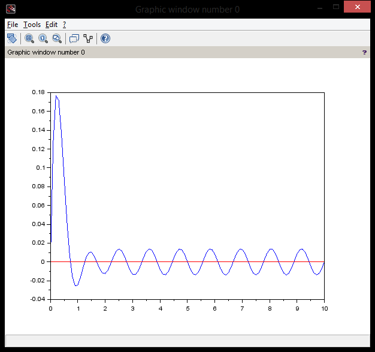

# Introdução
 Este artigo tem o objetivo de mostrar uma linguagem de programação onde será descrito sua origem e influências, criando uma linha o tempo para tal linguagem. Além disso, abordará sobre a classificação (imp/func/log/oo, est/din, usos) e comparará e avaliará relativamente com outras linguagens (read/write, expressividade).

Linguagem Abordada: **Scilab**

# Origens e Influências

 O Scilab é um software científico para computação numérica semelhante ao Matlab que fornece um poderoso ambiente computacional aberto para aplicações científicas.

 Desenvolvido desde 1990 pelos pesquisadores do INRIA (Institut National de Recherche en Informatique et en Automatique) e do ENPC (École Nationale des Ponts et Chaussées), então pelo Consorcio Scilab desde Maio de 2003, Scilab é agora mantido e desenvolvido pelo Scilab Enterprises desde Julho de 2012. Distribuído gratuitamente via Internet desde 1994, o Scilab é atualmente usado em diversos ambientes industriais e educacionais pelo mundo.

# Classificação

- Multiparadigma; 
- Multiplataforma;
- Estruturada;
- Dinâmica;
- Interpretada.

# Avaliação Comparativa

## Trabalhando com Matrizes podemos comparar a linguagem Scilab com {C}

	x = [1 1 0; 0 0 1; 1 1 1];
	y = [1 0 0; 1 1 1; 1 1 0];

	z = [x y]; //Unindo duas matrizes (linhas)
	c = [x;y]; //Unindo duas matrizes (colunas)

	t = z'; //Matriz transposta de z

	m = z*t; //Multiplicando duas matrizes

	disp(z,"z");
	disp(c,"c");
	disp(t,"t");
	disp(m,"m");

### Código em {C} de multiplicação de duas matrizes 3x3:

	#include <stdio.h>
	int main(){
 	 int i,j,k,aux = 0;
		int x[3][3] = {{1,1,0},{0,0,1},{1,1,1}};
		int y[3][3] = {{1,0,0},{1,1,1},{1,1,0}};
		int matriz[3][3];

		for(i=0;i<3;i++){
        		for(j=0;j<3;j++){
            			printf(" %d ",x[i][j]);
        		}
        		printf("\n");
		}
		printf("\n");

		for(i=0;i<3;i++){
        		for(j=0;j<3;j++){
            			printf(" %d ",y[i][j]);
        		}
        		printf("\n");
		}
		printf("\n");

		for(i=0;i<3;i++){
        		for(j=0;j<3;j++){

            			matriz[i][j] = 0;

            			for(k=0;k<3;k++){
                			aux += x[i][k]*y[k][j];
            			}

            			matriz[i][j] = aux;
            			aux = 0;

            			printf(" %d ",matriz[i][j]);
        		}
        		printf("\n");
		}

	return 0;
}

## Trabalhando com EDO'S em Scilab

### Solução numérica de uma EDO de primeira ordem:
	function dx = f(x,y)
    		dx = -2*x-y;
	endfunction

	y0 = -1;
	x0 = 0;
	t = 0.4;

	sol = ode(y0,x0,t,f);

	disp(sol,"answer");

answer -0.8109602
	
### Plotando gráfico com base nas soluções numéricas de uma EDO de segunda ordem:
	clf
	function dx = f(t,x)
    		dx(1) = x(2);
    		dx(2) = 25*fem(t)-6*x(2)-25*x(1);
	endfunction

	function v = fem(t)
    		v = 8*sin(120*t);
	endfunction

	t = 0:0.1:10;

	sol = ode([0;0],0,t,f);

	plot(t,sol(1,:));
	plot(t,0*t,"r");
	

	

# Conclusão

Como pode-se ser visto, o nível de abstração do Scilab é muito maior para efetuar operações com matrizes do que na linguagem C. 

### Scilab
- Mais Readability;
- Mais Writeability;
- Maior Expressividade.

### {C}
- Mais Readability;
- Menos Writeability;
- Menor Expressividade.  

